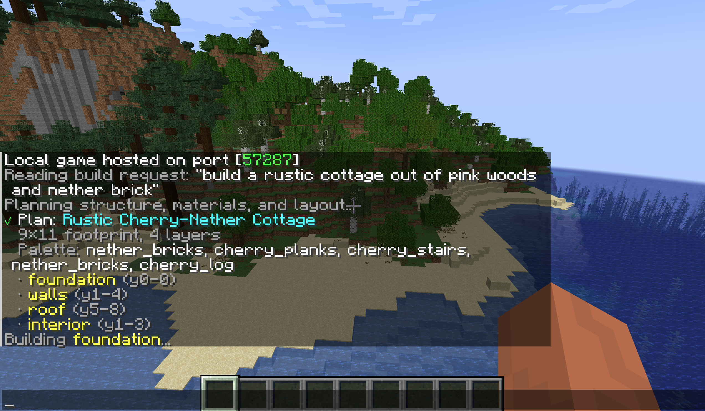
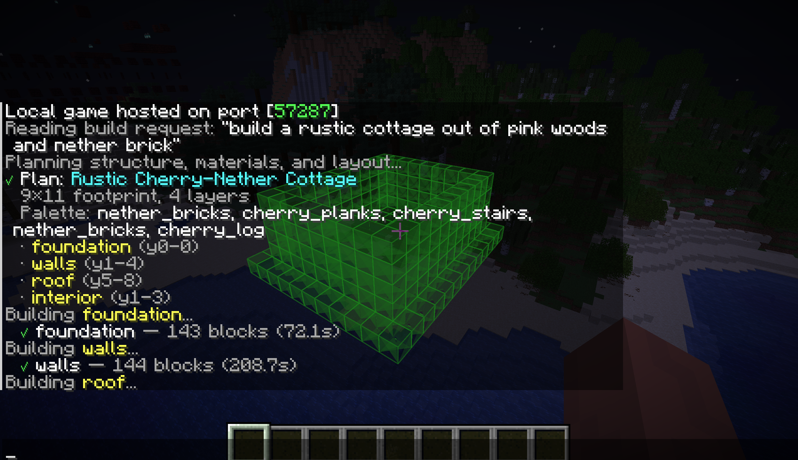
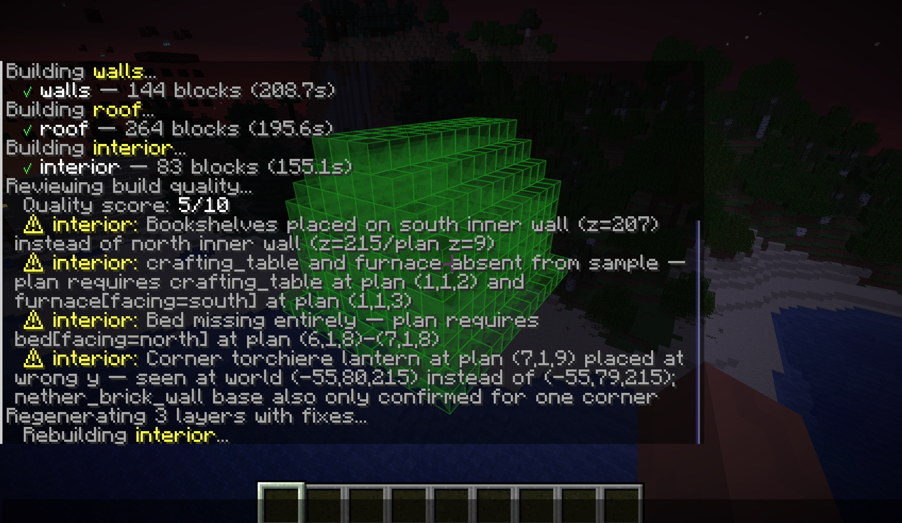

# ClaudeCraft

ClaudeCraft is basically Claude Code but for Minecraft. You press B, type what you want to build, and watch it happen block by block in front of you. It plans the build, generates each layer, critiques its own work, fixes mistakes, and lets you move/rotate the whole thing before placing it. You can also select existing blocks and reprompt to edit them — same iterative loop you'd use prompting code changes, but with blocks instead of files.

## How it works








## Setup

**Agent server** (runs on any machine with Claude Code installed):
```bash
cd agent-server
npm install
node src/index.js
```

**Fabric mod** (Minecraft 1.21.5):
```bash
cd fabric-mod
./gradlew build
# copy build/libs/claudecraft-1.0.0.jar to .minecraft/mods/
# also need Fabric API for 1.21.5 in mods/
```

**Controls**: B = build/edit, V = click select, G = volume select, R = rotate, Arrow keys = move, PgUp/PgDn = height, Enter = place, Esc = cancel

## Remote setup (SSH)

If the agent server is on a remote machine:
```bash
ssh -L 3001:localhost:3001 user@remote-host
```
The mod connects to `ws://localhost:3001` so the tunnel makes it seamless.
